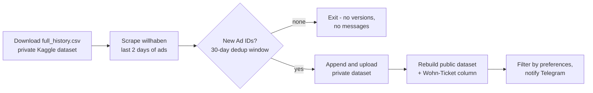

# Renting in Vienna

A stateless scraping pipeline for Vienna rental listings. Every few minutes it
fetches the newest apartments from [willhaben](https://www.willhaben.at/),
detects which ones it has never seen before, archives them in a Kaggle
dataset, and announces the ones matching my preferences in a
[Telegram channel](https://t.me/+1HPAYOf5BSsyNTlk) — often within minutes of
publication, which matters because the best deals disappear in under half an
hour.

## Architecture

The pipeline keeps **no state in this repository**. Its single source of truth
is `full_history.csv` in a *private* Kaggle dataset: an append-only log of
every listing ever scraped, keyed by Ad ID. Each run:



Because workflows never commit, runs are cheap, the git history stays clean,
and the scheduler isn't penalized by a busy repository.

### Why a deduplication *window*?

willhaben may recycle Ad IDs over long horizons, so an ID match against the
full history would silently swallow genuinely new apartments. A scraped ad
only counts as "already seen" if its ID appears in a history row published
within the last 30 days (configurable via `DEDUP_WINDOW_DAYS`). That window is
safe because the scraper only returns ads published in the last two days — an
ad we already recorded is always well inside it.

### Failure ordering

State is persisted before any user-visible side effect. If a later step fails,
the next run heals it: the public dataset is rebuilt from the full history on
every publication, and notifications are at-most-once by design (a rare missed
message beats duplicate spam and duplicate history rows). Data-integrity
guards abort the run — and visibly fail the workflow — if the history could
shrink, the scrape comes back empty, or the export drops rows.

## The public dataset

The [public Kaggle dataset](https://www.kaggle.com/) is the full history,
restricted to Vienna apartments (`State` "Wien", `Property Type` "Wohnung"),
with:

- a binary **`Wohn-Ticket`** column — 1 when the description marks the ad as
  reserved for holders of Vienna's social-housing ticket ("Wohnticket",
  "Wohn-Ticket", "wohn ticket", any casing);
- internal, constant, and redundant columns removed: `Ad ID`, `Description`,
  `Address`, `State` (constant after the filter), `District` (duplicated in
  `Location`), `Property Type` (constant after the filter), `Price`
  (duplicates `Rent (€)`), `Postcode` (duplicated in `Location`).

## Setup

1. **Create the Telegram bot** via [@BotFather](https://t.me/BotFather) and
   add it to your channel.
2. **Seed the private history dataset** from an existing `full_history.csv`
   (or a CSV with just the header row to start from scratch):

   ```bash
   cp .env.example .env   # fill in your values, then:
   set -a; source .env; set +a
   uv run vienna-rentals seed path/to/full_history.csv
   ```

3. **Create the public dataset** on Kaggle (one CSV upload of any valid
   export; the pipeline versions it from then on).
4. **Configure the repository secrets** (Settings → Secrets and variables →
   Actions):

   | Secret | Purpose |
   | --- | --- |
   | `KAGGLE_USERNAME` | Kaggle account name |
   | `KAGGLE_API_KEY` | Kaggle API token |
   | `PRIVATE_KAGGLE_DATASET_SLUG` | `user/slug` of the private history dataset |
   | `KAGGLE_DATASET_SLUG` | `user/slug` of the public dataset |
   | `BOT_API_KEY` | Telegram bot token |
   | `CHANNEL_ID` | Telegram channel/chat ID |

5. **Enable GitHub Actions.** The pipeline runs every 6 minutes (best-effort;
   GitHub's cron can stretch that) and can be triggered manually from the
   Actions tab.

## Local development

```bash
uv sync                                  # install (incl. dev tools)
uv run pytest                            # tests
uv run ruff check . && uv run ruff format --check .
uv run vienna-rentals run --dry-run --skip-telegram   # full run, no side effects
```

Personal filter preferences (price range, rooms, districts, listing age) live
in [`src/vienna_rentals/config.py`](src/vienna_rentals/config.py).

## Project layout

```
src/vienna_rentals/
├── cli.py        # entry point: run / seed / test-telegram
├── pipeline.py   # one end-to-end run; owns ordering and integrity guards
├── config.py     # constants + env-driven Settings
├── scraper.py    # willhaben search API client (batched, retrying)
├── models.py     # Listing dataclass <-> API payload <-> CSV schema
├── history.py    # append-only history, windowed new-listing detection
├── transform.py  # public export: Wohn-Ticket column, column pruning
├── kaggle_io.py  # Kaggle transport: credentials, download, publish
├── filtering.py  # personal preferences for notifications
└── telegram.py   # message formatting and delivery
```
